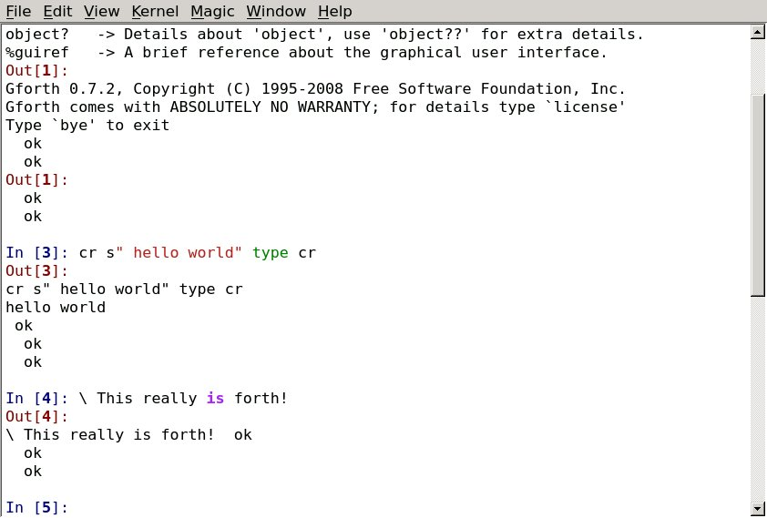

Do you want to get an arbitrary interpreter (well, nearly) running on the glorious IPython infrastructure quickly? Then you've come to the right place!

I am a complete newbie to IPython, but I thought it would be fun to
see if I could get something to work. This project is a complete
afternoon hack. It is based (stolen?) on dsblank's simple_kernel found
at

https://github.com/dsblank/simple_kernel

If you want to learn some IPython internals, then dsblank's project is
a good place to start.

# Prerequisites

python 3

# Example

Assuming you have gforth installed on your system, you can start a gforth interpretter by running:

    ./moonio

This will start a qtconsole.

The guts of the configuration is in the moonio.json file:

    { 
        "command" : "gforth" ,
        "expect"  : ".*ok\r\n"
    }

If you want to customise it to your own interpretter, then you are going to need to edit the two values `command` and `expect`. `command` is easy: it's just the executable that needs to be run.

`expect` is a little trickier. It is a regular expression that can take all of the latest output from the interpretter, and demarcate where it is expecting input.

In `gforth`, for example, it prints all its output, and then the text `ok` followed by a couple of control characters. `moonio` needs this a hint to know when output has finished. It is possible that this mechanism could be subverted, of course, with an output that corresponds to the interpetter's input prompt. You would have to go out of your way to be that evil, though.

# Screenshot

